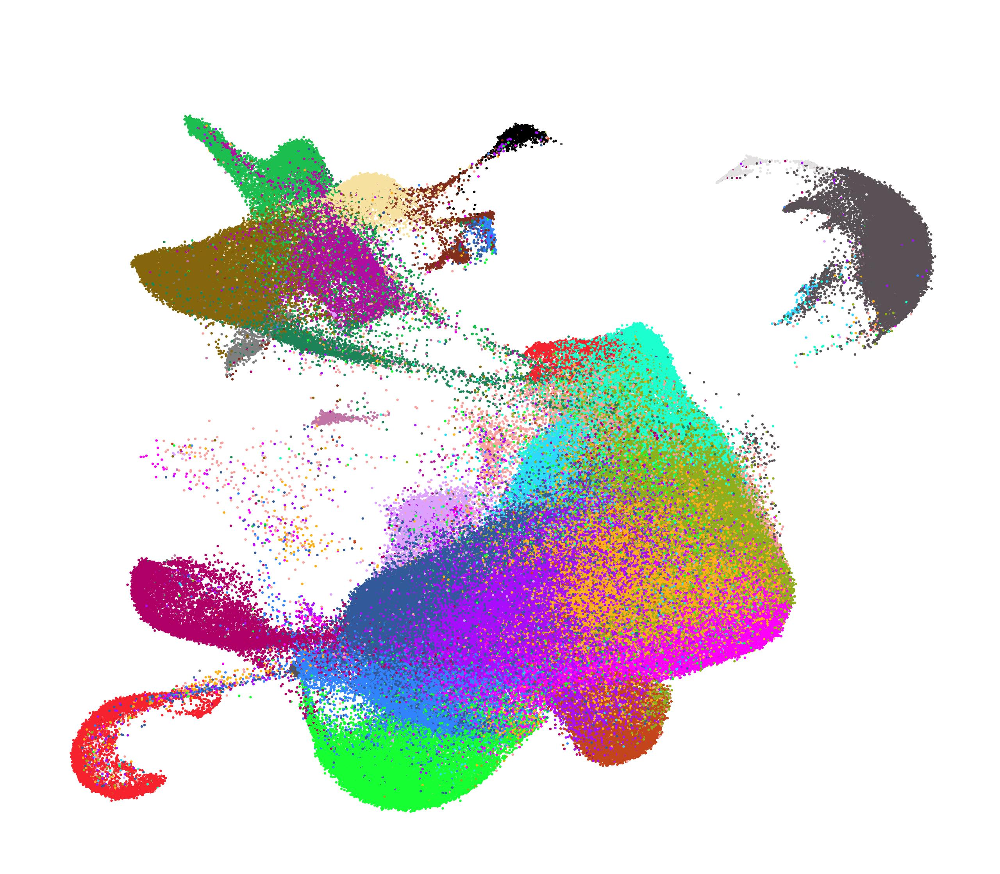

Welcome to the Tumor Immune Cell Atlas (TICA) web app!
===================

Here you will be able to use [our dataset](https://doi.org/10.5281/zenodo.4036019), for your own research, without downloading it or having to use bioinformatic tools.

The Tumor Immune Cell Atlas is a compendium of over 300 000 immune cells gathered from different publications and integrated into one single dataset, with the aim of understanding similarities in the tumor immune microenvironment of different cancer types. It contains cells from over 200 patients and 13 cancer types, such as non-small lung cancer, breast adenocarcinoma, ovarian and colorrectal cancer or uveal and cutaneous melanoma.

You can read our preprint [here](https://www.biorxiv.org/content/10.1101/2020.10.26.354829v1) to learn more about the publication, the advantages and applications of such dataset. To learn more about the creation of the atlas from the computational standpoint, you can check out our [GitHub repo](https://github.com/Single-Cell-Genomics-Group-CNAG-CRG/Tumor-Immune-Cell-Atlas).

You can use this web application to:

- Project your data onto the Atlas to obtain a cell-wise predicted annotation using our cell types as reference
- Annotate your clusters by automatically comparing your marker gene lists to the cell types in the atlas
- (**under development!**) Deconvolute your bulk-like RNA-seq data to obtain the cell type proportions using our reference

Depending on the function you want to use, you will need to upload different types of data. Check the 'How to use' tab, to learn which data formats we support.
You can get in touch with us for any question or suggestion on the 'Contact' tab.

---

