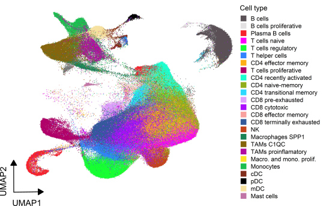

How to use the TICA web app
===================

You need RNA-seq data. We have only tested it with single-cell data, but it could potentially work (with varying results) with other types of RNA-seq data, as long as it complies with the required formats. It is possible that big datasets will not run here (we will be able to offer a solution for this soon).

For most of the funcionalities you will be able to select the desired "level" of annotation. There are slight differences in the depth of the annotation. **Level 1** consists of 25 annotated cell type, where as **Level 2** comprises 31, and many of these cell types are shared between both annotation levels.

 

### Projection

To project your data onto the atlas, you will need to upload a raw count matrix in csv format (comma-separated values), where rows are genes and columns are cell names (id). The gene names should be in symbol format and the cell ids must be unique.
You should ***not*** normalize your matrix, only raw counts yield accurate results. You can download an example file [here](https://github.com/Single-Cell-Genomics-Group-CNAG-CRG/TICA_app/blob/main/test_data/test_projection.csv).

Under the hood, we use Rahul Satija's [Seurat](https://satijalab.org/seurat/index.html) to project data onto the atlas and predict the cell types.
Because we only have immune cells, we recommend non-immune cells to be filtered previously. Otherwise, it can alter the overall accuracy of the predictions.

Once your file has bee updated and validated to make sure it has the expected format, you will be able to run the projection. 
You can tune in the number of principal components (PCs) to use for the projection. We recommend using between 20 and 30, but this depends on your dataset.
Once the projection has finished running, you will see a barplot with the number of cells predicted in each category and you will be able to download a csv file with the cell-wise annotation plus a confidence score. Low confidence scores indicate less accuracy in the projection.

### Annotation

To annotate your clusters, you will need to upload a csv file that contains (at least) the columns *gene* and *cluster*. With this function you will be able to compare your clusters' marker genes to those of the cell types in the atlas. An example of the type of file we expect can be found [here](https://github.com/Single-Cell-Genomics-Group-CNAG-CRG/TICA_app/blob/main/test_data/test_annotation_H.csv) and [here](https://github.com/Single-Cell-Genomics-Group-CNAG-CRG/TICA_app/blob/main/test_data/test_annotation_m.csv). We recommend pre-filtering the genes according to the assigned p-values or fold-changes, and keeping between 50 and 100 marker genes per cluster.

These function supports both human and mouse genes and the output it produces is a heatmap of the Jaccard Index (similarity) between the two sets of marker genes. Jaccard Index values are relative to the number of input genes per cluster.

We use Elisabetta Mereu's [MatchSCore2](https://github.com/elimereu/matchSCore2) to compute the similarities between markers.

### Deconvolution

This functionality is under development and will be available soon. Sorry for the inconvenience!

 
 

If you experience any unexpected behaviors, have any suggestion, comment or question, feel free to contact us.

